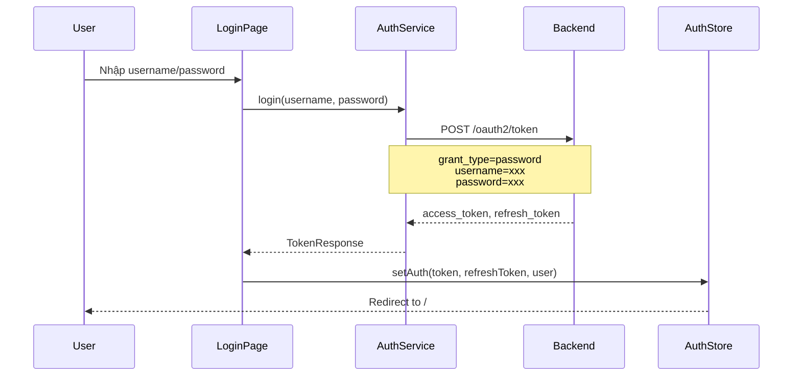
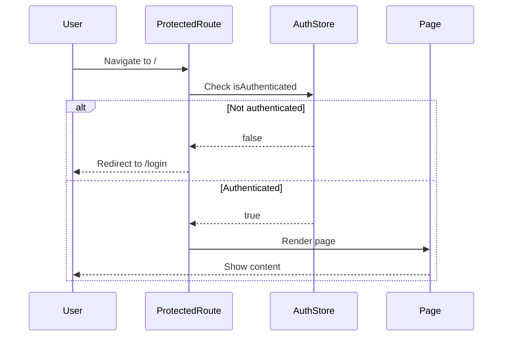
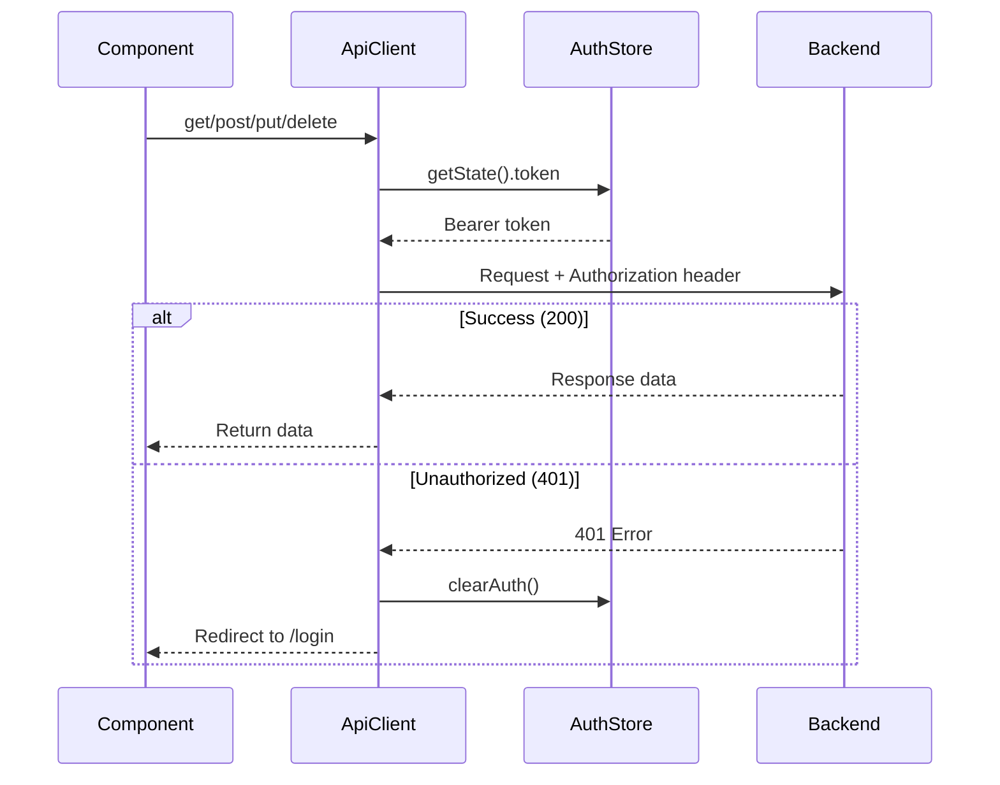
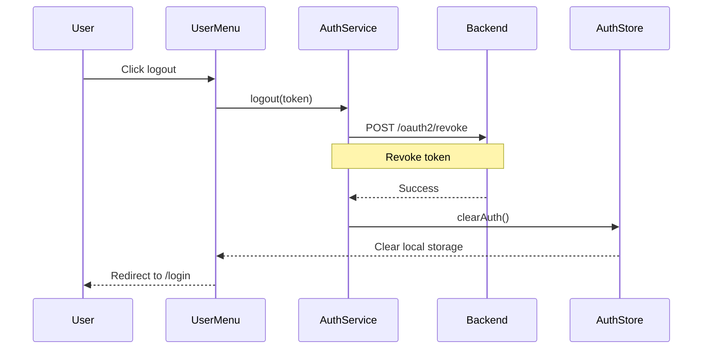

# Authentication Flow

## 🔐 OAuth2 Password Grant Flow

### 1. Login Process



### 2. Protected Routes



### 3. API Calls with Token



### 4. Logout Process



---

## 📂 Files Structure

```
chat-demo/
├── store/
│   └── authStore.ts              # Zustand store - auth state
├── services/
│   └── auth.service.ts           # OAuth2 login/logout/refresh
├── lib/
│   └── api-client.ts             # Axios instance + interceptors
├── components/
│   ├── ProtectedRoute.tsx        # Route guard
│   └── UserMenu.tsx              # User avatar + logout
└── app/
    └── login/
        └── page.tsx              # Login page
```

---

## 🔧 Configuration

### Backend Endpoint

```
POST http://localhost:12391/oauth2/token
Content-Type: application/json

{
  "grant_type": "password",
  "username": "tnguyen",
  "password": "Password0d!@#"
}
```

### Response Format

```json
{
  "access_token": "eyJhbGciOiJIUzI1NiIsInR5cCI6IkpXVCJ9...",
  "refresh_token": "xxx-refresh-token-xxx",
  "token_type": "Bearer",
  "expires_in": 3600,
  "userId": 1,
  "username": "tnguyen",
  "fullName": "Nguyen Thanh",
  "email": "tnguyen@example.com",
  "roles": ["user", "admin"]
}
```

---

## 🛠️ Tech Stack

### Axios
- HTTP client
- Request/Response interceptors
- Auto attach Authorization header

### Zustand
- Lightweight state management
- Persist middleware (localStorage)
- Type-safe with TypeScript

---

## ✅ Features

### ✨ Implemented

- [x] Login page với OAuth2 Password Grant
- [x] Token storage trong localStorage (persist)
- [x] Protected routes - redirect to /login nếu chưa auth
- [x] Auto attach Bearer token vào mọi API requests
- [x] 401 handling - auto logout và redirect
- [x] Logout functionality
- [x] User menu với avatar
- [x] Loading states

### 🔄 Optional Enhancements

- [ ] Refresh token auto-renewal
- [ ] Remember me checkbox
- [ ] Login with social providers
- [ ] 2FA support
- [ ] Session timeout warning
- [ ] Concurrent login detection

---

## 🚀 Usage

### 1. Start Backend
```bash
cd SourceAPI/SourceAPI
dotnet run
```

Backend chạy ở: `http://localhost:12391`

### 2. Start Frontend
```bash
cd chat-demo
npm run dev
```

Frontend chạy ở: `http://localhost:3001`

### 3. Login

Truy cập: `http://localhost:3001`

Nếu chưa login → tự động redirect đến `/login`

Demo credentials:
- Username: `tnguyen`
- Password: `Password0d!@#`

### 4. Test Flow

1. ✅ Login thành công → redirect về `/`
2. ✅ Token được lưu vào localStorage
3. ✅ Mọi API calls tự động có Authorization header
4. ✅ Click avatar → xem user menu
5. ✅ Click "Đăng xuất" → clear token → redirect `/login`

---

## 🐛 Troubleshooting

### Lỗi: "401 Unauthorized"
- Kiểm tra backend có chạy không
- Kiểm tra endpoint `/oauth2/token` có đúng không
- Verify credentials trong .env.local

### Token bị mất sau reload
- Kiểm tra zustand persist middleware
- Check localStorage có key `auth-storage` không

### API calls không có token
- Kiểm tra axios interceptor trong `api-client.ts`
- Verify `useAuthStore.getState().token` có giá trị

---

**Version**: 2.0.0  
**Updated**: 2025-10-28  
**OAuth2 Flow**: Password Grant  
**State Management**: Zustand + localStorage

